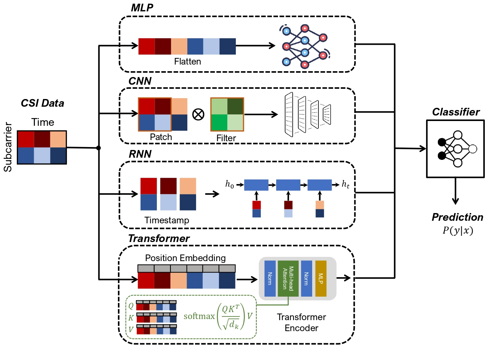

# Deep Learning and Its Applications to WiFi Human Sensing: A Benchmark and A Tutorial
## Introduction
WiFi sensing has been evolving rapidly in recent years. Empowered by propagation models and deep learning methods, many challenging applications are realized such as WiFi-based human activity recognition and gesture recognition. However, in contrast to deep learning for visual recognition and natural language processing, no sufficiently comprehensive public benchmark exists. In this paper, we highlight the recent progress on deep learning enabled WiFi sensing, and then propose a benchmark, SenseFi, to study various deep learning models for WiFi sensing. These advanced models are compared in terms of different tasks, WiFi platforms, recognition accuracy, model size, computational complexity, feature transferability, and adaptability of unsupervised learning. The extensive experiments provide us with experiences on deep model design, learning strategy skills and training techniques for real-world applications. To the best of our knowledge, this is the first benchmark with an open-source library for deep learning in WiFi sensing research.

## Requirements

1. Install `pytorch` and `torchvision` (we use `pytorch==1.10.2` and `torchvision==0.11.3`).
2. `pip install -r requirements.txt`

## Run
### Download Processed Data
Please download and organize the [processed datasets](https://drive.google.com/drive/folders/13qxmFQ-h8ei2m7EbBQOCxCHZJ_cDJGFY) in this structure:
```
Benchmark
├── Data
    ├── NTU-Fi_HAR
    │   ├── test_amp
    │   ├── train_amp
    ├── NTU-Fi-HumanID
    │   ├── test_amp
    │   ├── train_amp
    ├── UT_HAR
    │   ├── data
    │   ├── label
    ├── Widardata
    │   ├── test
    │   ├── train
```

### Supervised Learning
To run models with supervised learning (train & test):  
Run: `python run.py --model [model name] --dataset [dataset name]`  

You can choose [model name] from the model list below
- MLP
- LeNet
- ResNet18
- ResNet50
- ResNet101
- RNN
- GRU
- LSTM
- BiLSTM
- CNN+GRU
- ViT

You can choose [dataset name] from the dataset list below
- UT_HAR_data
- NTU-Fi-HumanID
- NTU-Fi_HAR
- Widar

*Example: `python run.py --model ResNet18 --dataset NTU-Fi_HAR`*
### Self-supervised Learning
To run models with self-supervised learning (train & test):  
Run: `python self_supervised.py --model [model name] ` 

You can choose [model name] from the model list below
- MLP
- LeNet
- ResNet18
- ResNet50
- ResNet101
- RNN
- GRU
- LSTM
- BiLSTM
- CNN+GRU
- ViT

*Example: `python self_supervised.py --model MLP`*  
[*AutoFi: Towards Automatic WiFi Human Sensing via Geometric Self-Supervised Learning*](https://doi.org/10.48550/arXiv.2205.01629)  


## Model
### MLP
- It consists of 3 fully-connected layers followed by activation functions 
### LeNet
- **self.encoder** : It consists of 3 convolutional layers followed by activation functions and Maxpooling layers to learn features
- **self.fc** : It consists of 2 fully-connected layers followed by activation functions for classification
### ResNet
- ***class*** **Bottleneck** : Each bottleneck consists of 3 convolutional layers followed by batch normalization operation and activation functions. And adds resudual connection within the bottleneck
- ***class*** **Block** : Each block consists of 2 convolutional layers followed by batch normalization operation and activation functions. And adds resudual connection within the block
- **self.reshape** : Reshape the input size into the size of 3 x 32 x 32
- **self.fc** : It consists of a fully-connected layer
### RNN
- **self.rnn** : A one-layer RNN structure with a hidden dimension of 64
- **self.fc** : It consists of a fully-connected layer
### GRU
- **self.gru** : A one-layer GRU structure with a hidden dimension of 64
- **self.fc** : It consists of a fully-connected layer
### LSTM
- **self.lstm** : A one-layer LSTM structure with a hidden dimension of 64
- **self.fc** : It consists of a fully-connected layer
### BiLSTM
- **self.lstm** : A one-layer bidirectional LSTM structure with a hidden dimension of 64
- **self.fc** : It consists of a fully-connected layer
### CNN+GRU
- **self.encoder** : It consists of 3 convolutional layers followed by activation functions
- **self.gru** : A one-layer GRU structure with a hidden dimension of 64
- **self.classifier** : It consistis a dropout layer followed by a fully-connected layer and an activation function
 ### ViT
- ***class*** **PatchEmbedding** : Divide the 2D inputs into small pieces of equal size. Then concatenate each piece with cls_token and do positional encoding operation
- ***class*** **ClassificationHead** : It consists of a layer-normalization layer followed by a fully-connected layer
- ***class*** **TransformerEncoderBlock** : It consists of multi-head attention block, residual add block and feed forward block. The structure is shown below:  


## Dataset
#### UT-HAR
- **size** : 1 x 250 x 90
- **number of classes** : 7
- **classes** : lie down, fall, walk, pickup, run, sit down, stand up
- **train number** : 3977
- **test number** : 996  
[*A Survey on Behavior Recognition Using WiFi Channel State Information*](https://ieeexplore.ieee.org/document/8067693) [[Github]](https://github.com/ermongroup/Wifi_Activity_Recognition)

#### NTU-HAR
- **size** : 3 x 114 x 500
- **number of classes** : 6
- **classes** : box, circle, clean, fall, run, walk
- **train number** : 936
- **test number** : 264
#### NTU-HumanID
- **size** : 3 x 114 x 500
- **number of classes** : 14
- **classes** : gaits of 14 subjects
- **train number** : 546
- **test number** : 294  

*Examples of NTU-Fi data*  


#### Widar
- **size** : 22 x 20 x 20
- **number of classes** : 22
- **classes** :  
Push&Pull, Sweep, Clap, Slide, Draw-N(H), Draw-O(H),Draw-Rectangle(H),  
Draw-Triangle(H), Draw-Zigzag(H), Draw-Zigzag(V), Draw-N(V), Draw-O(V), Draw-1,  
Draw-2, Draw-3, Draw-4, Draw-5, Draw-6, Draw-7, Draw-8, Draw-9, Draw-10  
- **train number** : 34926
- **test number** : 8726  

*Classes of Widar data*  
  
[*Widar3.0: Zero-Effort Cross-Domain Gesture Recognition with Wi-Fi*](https://ieeexplore.ieee.org/document/9516988) [[Project]](http://tns.thss.tsinghua.edu.cn/widar3.0/)
## Reference
